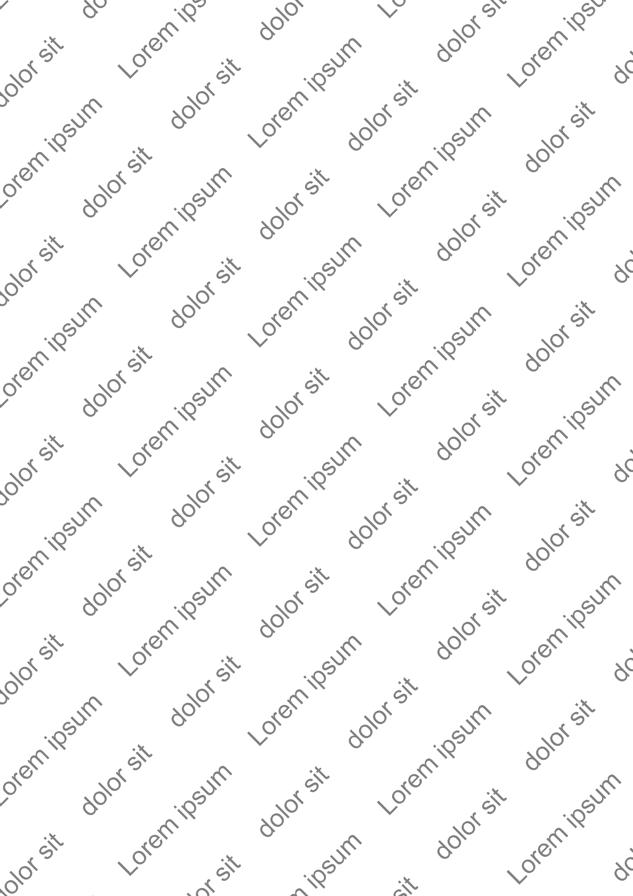

# create_watermark.py
avilable options :
```python
DPI: int = 300
TEXTS: list[str] = [
    "Lorem ipsum", "dolor sit"
]
OPACITY: float = 0  # value in [0,1]
FONT_NAME: str = "arial"
FONT_SIZE: int = DPI//3
TEXT_COLOR: str | tuple[int, int, int] = "gray"
ANGLE: int = 45
SPACER: str = "     "
REPETITIONS: int = 8
ROW_SPACING: int = DPI*1.3
START_Y_OFFSET: int = 0
```
result in:
